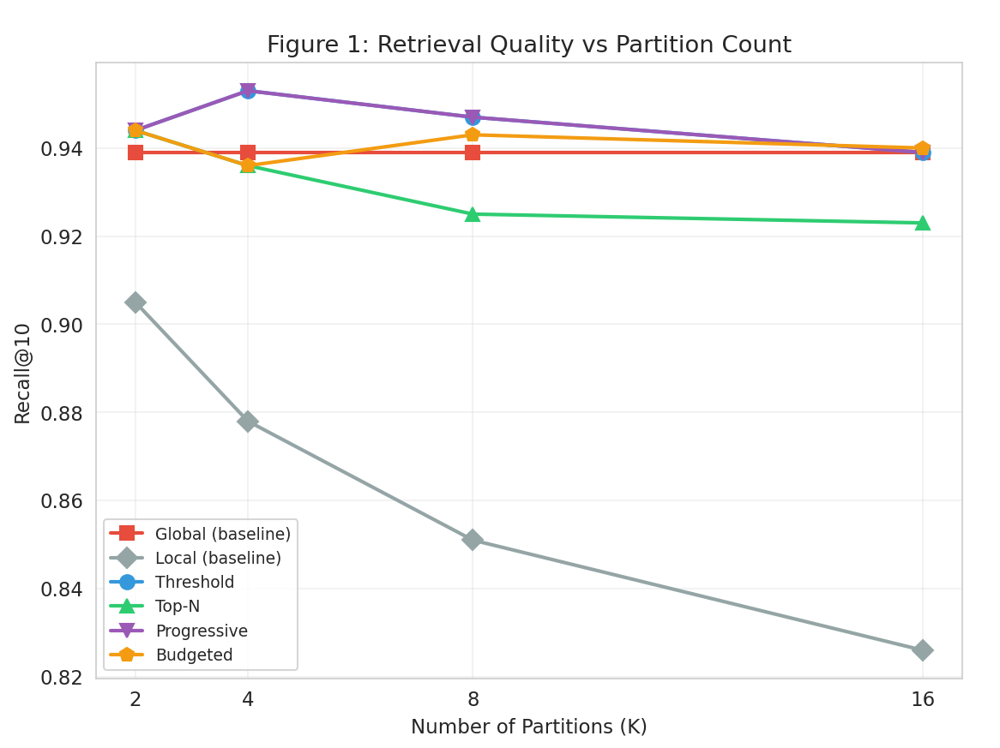

# Communication-Efficient Distributed Vector Memory

[](https://doi.org/10.5281/zenodo.21445007)

**Investigating Adaptive Routing Across Partitioned Semantic Memories**

This repository contains the code and data for our paper on adaptive routing strategies for distributed vector databases.

## Overview

We propose four routing strategies that reduce communication costs in distributed vector search while maintaining retrieval quality:

1. **Confidence Threshold** — Expand search when confidence is low
2. **Top-N Neighbors** — Always query N closest partitions
3. **Progressive Expansion** — Expand until confidence target met
4. **Budgeted Communication** — Hard limit on partitions contacted

## Key Results

- **42% communication reduction** with 100% recall retention at K=16
- **KMeans outperforms random partitioning** by 8-12%
- **Adaptive routing matches global recall** with sub-linear communication

### Communication-Quality Tradeoff

.png)

Adaptive strategies achieve comparable recall with significantly less communication than broadcasting.

### Recall vs Number of Partitions



While local-only search degrades with more partitions, adaptive strategies maintain stable recall.

## Repository Structure

```
├── paper/
│   ├── main.tex                    # LaTeX source
│   ├── main.pdf                    # Compiled paper
│   ├── figure1_*.png               # Publication figures
│   ├── figure2_*.png
│   ├── figure3_*.png
│   └── figure4_*.png
├── notebook/
│   └── dbpedia14_distributed_memory.ipynb  # Kaggle notebook
├── README.md
└── LICENSE
```

## Dataset

**DBpedia 14** — 100K documents across 14 semantic classes:
- Company, EducationalInstitution, Artist, Athlete
- OfficeHolder, MeanOfTransportation, Building
- NaturalPlace, Village, Animal, Plant
- Album, Film, WrittenWork

## Requirements

```bash
pip install turbovec sentence-transformers scikit-learn matplotlib seaborn datasets
```

## Usage

### Run on Kaggle
1. Upload `notebook/dbpedia14_distributed_memory.ipynb` to Kaggle
2. Enable internet access
3. Run all cells

### Run locally
```bash
cd notebook
jupyter notebook dbpedia14_distributed_memory.ipynb
```

## Citation

```bibtex
@article{[your_name]2026distributed,
  title={Communication-Efficient Distributed Vector Memory: Investigating Adaptive Routing Across Partitioned Semantic Memories},
  author={[Your Name]},
  year={2026}
}
```

## License

- **Code** (notebook, scripts): [MIT License](LICENSE)
- **Paper and figures**: CC BY 4.0

## Links

- [Paper on Zenodo](https://doi.org/10.5281/zenodo.21445007)
- [Kaggle Notebook](https://www.kaggle.com/)
